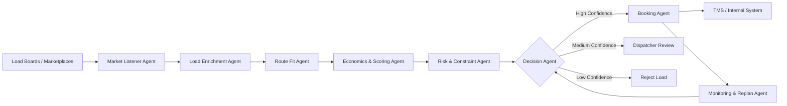
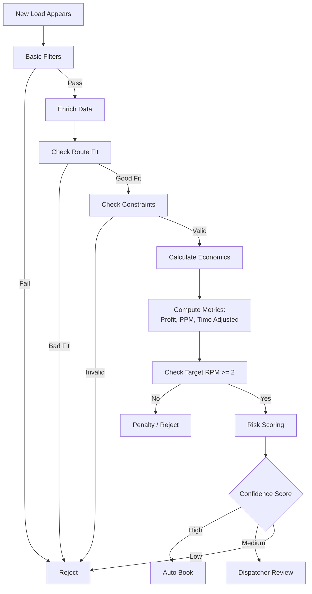
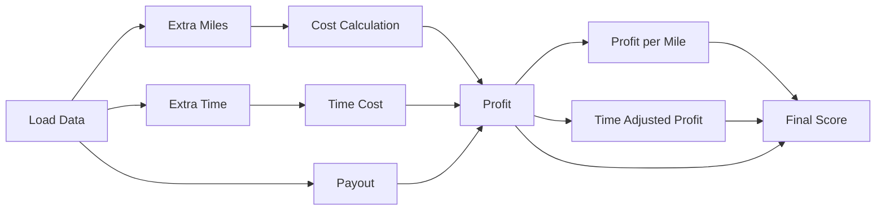

# Autopilot Load Selection System for Car Hauling


## 1. Overview

This solution describes an AI-driven (multi-agent) autopilot system for selecting an additional vehicle load in a car hauling scenario.

### Scenario:
- Trailer capacity: 3 cars (1 slot available)
- Route: Boston, MA → Denver, CO
- Existing deliveries:
  - Des Moines, IA
  - Denver, CO
- Driver speed: ~700 miles/day

### Goal:
Automatically select and book the most profitable third vehicle load from load boards without significantly degrading route efficiency or increasing operational risk.

---

## 2. System Architecture



### Description

The system is built as a **multi-agent pipeline**:

- **Market Listener Agent** — collects loads from APIs / scraping  
- **Load Enrichment Agent** — expands full load data  
- **Route Fit Agent** — checks route compatibility  
- **Economics Agent** — calculates profitability  
- **Risk Agent** — validates constraints  
- **Decision Agent** — selects best option  
- **Booking Agent** — executes booking  
- **Monitoring Agent** — handles re-planning  

---

## 3. Decision Flow



---

## 4. Profitability Model

### Inputs

- `P` — payout  
- `M_add` — additional miles  
- `T_add` — additional time  
- `C_mile` — cost per mile  
- `C_time` — time cost  
- `Risk_penalty`  
- `Route_penalty`  

---

### Profit

```
Profit = P 
       - (M_add * C_mile)
       - (T_add * C_time)
       - Risk_penalty
       - Route_penalty
```

---

### Profit per Mile

```
PPM = Profit / M_add
```

---

### Time-Adjusted Profit

```
TimeAdjustedProfit = Profit / (1 + T_add)
```

---

### Trip RPM

```
ProjectedTripRPM = TotalRevenue / TotalMiles
```

Target:
- ≥ 2.0 → good  
- < 1.8 → reject  

---

## 5. Economics Flow



---

## 6. Route Strategy

### Best candidates:
- Pickup near Boston
- Delivery along Boston → Des Moines → Denver corridor

### Worst candidates:
- Large detours
- Backtracking
- Tight pickup windows
- Off-route deliveries

---

## 7. Constraints

### Hard (reject immediately):
- Vehicle does not fit
- Impossible timing
- Missing critical data
- Excessive detour

### Soft:
- Broker reliability
- Time flexibility
- Loading complexity

---

## 8. Risk Scoring

Penalties applied for:
- Low broker score
- Tight windows
- No drop box
- Appointment delivery
- Missing data

---

## 9. Auto-Booking Rules

Autopilot allowed if:

- Confidence ≥ 0.85  
- RPM ≥ 2.0  
- Low risk  
- Valid constraints  
- Minimal detour  

Else → dispatcher review

---

## 10. Failure Cases

- Route inefficiency
- Time window violations
- Hidden constraints
- Wrong vehicle assumptions
- Data quality issues
- Market latency (lost loads)
- Unsafe auto-booking

---

## 11. Monitoring

System tracks:
- ETA changes
- cancellations
- better opportunities

Triggers re-planning if needed

---

## 12. Example Output

```
Selected Load: VIN XXXXX

Added miles: 32  
Added time: 0.15 day  
Payout: $750  
Profit: $540  
Trip RPM: 2.18  

Decision: AUTO-BOOK
```

---

## 13. Conclusion

The system enables safe and efficient autopilot dispatching by:

- optimizing full trip profitability  
- minimizing risk  
- maintaining route efficiency  
- enabling explainable AI decisions  


## 14. Example Simulation: Selecting the Third Vehicle

This section demonstrates how the autopilot can evaluate multiple real vehicle loads and choose the most profitable third car for the remaining trailer slot.

### 14.1 Existing Confirmed Vehicles

The trailer already has two confirmed vehicles:

| Slot | VIN | Year | Make | Model | Pickup | Delivery |
|------|-----|------|------|-------|--------|----------|
| 1 | 1HGCM82633A123456 | 2021 | Toyota | Camry | Boston, MA | Des Moines, IA |
| 2 | 1FTFW1E50MFA65432 | 2022 | Ford | F-150 | Boston, MA | Denver, CO |

### Route Context

- Route start: **Boston, Massachusetts**
- Existing delivery points:
  - **Des Moines, Iowa**
  - **Denver, Colorado**
- Driver average speed: **700 miles/day**
- Trailer capacity: **3 vehicles**
- Remaining capacity: **1 vehicle**

The autopilot must evaluate available marketplace loads and select the best third car without significantly degrading the route.

---

### 14.2 Candidate Vehicles from Load Boards

Below are three simulated candidate vehicle loads discovered through load boards / marketplaces.

| Candidate | VIN | Year | Make | Model | Pickup | Delivery | Payout | Extra Miles | Extra Time | Broker Score | Delivery Notes |
|-----------|-----|------|------|-------|--------|----------|--------|-------------|------------|--------------|----------------|
| A | 5NPE24AF8FH085421 | 2020 | Hyundai | Sonata | Boston, MA | Chicago, IL | $900 | 45 | 0.2 day | A | Flexible delivery |
| B | 3CZRM3H59FG704221 | 2019 | Honda | CR-V | Worcester, MA | Omaha, NE | $1,050 | 80 | 0.3 day | B | Appointment preferred |
| C | JN1AZ4EH3DM430987 | 2021 | Nissan | 370Z | Providence, RI | Salt Lake City, UT | $1,400 | 390 | 0.9 day | A | Tight delivery window |

---

### 14.3 Why Vehicle Details Matter

The autopilot should not evaluate loads based only on payout and destination.  
Vehicle-level attributes matter because they may affect trailer fit, loading complexity, unloading order, and operational risk.

For example:
- a **Ford F-150** already occupies one slot and may create space/weight constraints
- a lower sedan such as **Hyundai Sonata** is usually easy to place operationally
- a sports coupe like **Nissan 370Z** may introduce additional care requirements and a route detour that offsets its higher payout

This means the system should evaluate both:
1. **trip economics**
2. **vehicle compatibility and execution feasibility**

---

### 14.4 Assumptions for the Simulation

- Cost per extra mile = **$0.85**
- Time cost per extra day = **$250**
- Target trip RPM = **$2.00 / mile**
- Broker score below A introduces mild risk penalty
- Loads with major detours receive route penalty
- Tight delivery windows increase execution risk

---

### 14.5 Profitability Calculation

#### Candidate A — 2020 Hyundai Sonata
```text
Profit = 900 - (45 × 0.85) - (0.2 × 250)
Profit = 900 - 38.25 - 50
Profit = $811.75
```

#### Candidate B — 2019 Honda CR-V
```text
Profit = 1050 - (80 × 0.85) - (0.3 × 250)
Profit = 1050 - 68 - 75
Profit = $907.00
```

#### Candidate C — 2021 Nissan 370Z
```text
Profit = 1400 - (390 × 0.85) - (0.9 × 250)
Profit = 1400 - 331.50 - 225
Profit = $843.50
```

---

### 14.6 Derived Metrics

| Candidate | Vehicle | Profit | Profit per Extra Mile | Time-Adjusted Profit | Route Fit | Operational Risk | Estimated Trip RPM |
|-----------|---------|--------|------------------------|----------------------|-----------|------------------|--------------------|
| A | 2020 Hyundai Sonata | $811.75 | 18.04 | 676.46 | High | Low | 2.21 |
| B | 2019 Honda CR-V | $907.00 | 11.34 | 697.69 | Medium | Medium | 2.08 |
| C | 2021 Nissan 370Z | $843.50 | 2.16 | 443.95 | Low | High | 1.79 |

---

### 14.7 Vehicle-Aware Decision Logic

The system should evaluate each candidate not only as a lane, but as a specific vehicle load.

#### Candidate A — Hyundai Sonata
Advantages:
- pickup directly in Boston
- sedan format is operationally simple
- strong route fit toward Midwest corridor
- low extra miles
- low execution risk

Concerns:
- lower raw payout than Candidate C
- lower raw profit than Candidate B

#### Candidate B — Honda CR-V
Advantages:
- highest raw profit
- still roughly aligned with the route toward Denver
- SUV is common and manageable

Concerns:
- pickup outside Boston adds deadhead
- moderate detour
- broker score is weaker
- appointment-based delivery adds coordination risk

#### Candidate C — Nissan 370Z
Advantages:
- highest payout
- strong broker score

Concerns:
- major route deviation
- poor trip RPM
- tight delivery window
- sports car may require additional handling caution
- degrades overall trip structure

---

### 14.8 Final Selection

**Selected Candidate: A — 2020 Hyundai Sonata**

### Why Candidate A is selected

Even though Candidate C has the highest payout and Candidate B has the highest raw profit, Candidate A delivers the best **overall trip outcome**:

- minimal route deviation
- Boston pickup with no meaningful deadhead
- good compatibility with existing trailer plan
- low operational risk
- strong profit relative to added miles
- projected trip RPM remains safely above the target threshold

This is exactly the type of decision an autopilot should make:  
**not choosing the highest payout blindly, but optimizing the full route economics and execution reliability.**

---

### 14.9 Example Decision Output

```text
Selected Load: Candidate A

VIN: 5NPE24AF8FH085421
Vehicle: 2020 Hyundai Sonata
Pickup: Boston, MA
Delivery: Chicago, IL

Added miles: 45
Added time: 0.2 day
Payout: $900
Profit: $811.75
Profit per extra mile: $18.04
Time-adjusted profit: $676.46
Projected Trip RPM: 2.21
Broker score: A
Operational risk: Low

Decision: AUTO-BOOK
```

---

### 14.10 Visual Validation

The simulated decision can be validated visually using charts and route maps:

- **Bar chart:** profit by candidate
- **Bar chart:** time-adjusted profit by candidate
- **Bar chart:** projected trip RPM by candidate
- **Map / route chart:** current route and candidate delivery directions
- **Final score chart:** weighted ranking combining route fit, risk, and profitability

This makes the autopilot decision explainable for dispatchers and helps validate that the selected vehicle improves the trip rather than just adding revenue on paper.

---

### 14.11 Key Takeaway

This simulation shows that the agent should reason over **vehicle-level load data**, not just route points.

A correct autopilot decision depends on:
- the vehicle itself
- where it is picked up and delivered
- how it fits the current route
- how much time and distance it adds
- whether it improves or harms trip-level profitability

## 15. Simulation Charts

The following interactive chart pack validates the simulated decision logic for selecting the third vehicle.

Interactive version: [Open simulation charts](./simulation_charts.html)

Preview:


